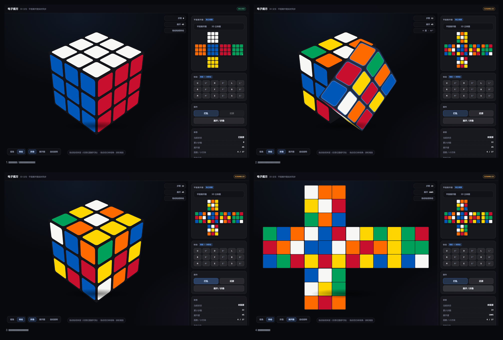

# 电子魔方 · Electronic Rubik's Cube

一个**单文件、零依赖**的可交互电子魔方：既能在 3D 立体视角下拧，也能看数学题里那种**十字展开图**。



## 快速开始

直接用浏览器打开：

```
outputs/electronic-cube.html
```

双击即可，不需要服务器、不需要联网、没有任何外部依赖。

## 功能

### 3D 电子魔方
- 27 个小方块，转动时**整层 9 块刚性联动**
- **拖拽贴纸转层**：在贴纸上按住拖动，按拖动方向决定转哪个面、转多少
- 拖动空白处转视角，滚轮缩放，松手有惯性
- 支持键盘 `U D L R F B M E S`（按住 `Shift` 逆时针）

### 平面展开图
- 侧栏实时显示十字形六面展开图
- 主图与侧栏**视图各自独立**：主图立体时侧栏可看展开，主图展开时侧栏可看迷你 3D，互不同步

### 展开 / 折叠动画
- 6 个面片**同时**沿铰链旋出，折叠回立方体

## 目录结构

```
electronic-cube.html        # 交付物：单文件应用（构建产物）
outputs/                    # 交付物与预览图
work/
  cube-core.js              # 核心数学库（3x3 / 4x4 矩阵、面定义、铰链）
  cube-model.js             # 模型层（cubie 状态、转动、读色、展开映射）
  app.js                    # 应用层（渲染、交互、动画、拖拽）
  part1.html                # 样式
  part2.html                # 页面结构
  build.js                  # 构建脚本：合并以上文件 -> outputs/electronic-cube.html
  *_test.js / sim-play.js   # 测试脚本
```

## 构建

```bash
node work/build.js
node --check work/_syntax.js
```

`build.js` 把 `part1.html` + `part2.html` + `cube-core.js` + `cube-model.js` + `app.js`
合并成单文件 `outputs/electronic-cube.html`。

## 设计要点

- **单一状态源**：转动状态统一为一个 `spin` 对象，拖拽 / 阻尼吸附 / 队列动画都走它，
  每次转动必经一次 `commitSpin`，保证「视觉转几格 = 逻辑转几格」。
- **拖拽方向判定**：把拖拽向量投影到 6 个候选轴（3 轴 x 正反）的切线上，取最对齐者；
  幅度用恒定灵敏度线性给出，避免边缘位置出现「拖了却没反应」。
- **性能**：避免 `backdrop-filter`，伪元素合并进渐变，平面块常驻合成树，加载时预热光栅化。

## 许可

个人项目，未声明开源许可。
